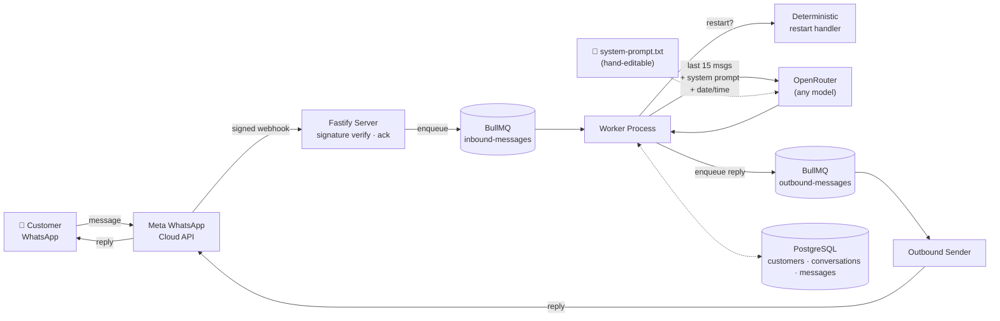

<div align="center">

# 🌾 Brunda Traders — WhatsApp AI Assistant

**A production WhatsApp customer-support agent built directly on Meta's Cloud API — no third-party BSP, no vendor lock-in.**

[](https://nodejs.org)
[](https://www.typescriptlang.org)
[](https://fastify.dev)
[](https://www.postgresql.org)
[](https://redis.io)
[](https://www.docker.com)
[](#)

</div>

---

## Overview

Brunda Traders is a wholesale/retail rice trading business. This service gives it an AI-powered WhatsApp assistant that answers product and pricing questions, recognizes returning customers, and holds a natural, context-aware conversation — all on the **Meta WhatsApp Business Cloud API** directly, with **[OpenRouter](https://openrouter.ai)** as a model-agnostic LLM gateway so the underlying AI model is a one-line config change, not a code change.

This is **Phase 1**: a complete, tested, deployed assistant with memory, a hand-editable business knowledge file, and production-grade reliability. Phase 2 (admin dashboard, database-backed pricing, RAG knowledge base, CRM sync) builds on this same foundation once real conversations validate the approach.

## Features

- 💬 **Direct Meta Cloud API integration** — HMAC-signed webhooks, no Twilio or BSP middleman
- 🧠 **Conversational memory** — the last 15 messages are sent on every turn for context and personalization
- 🔀 **Model-agnostic LLM gateway** — swap between Claude, GPT, Gemini, or any OpenRouter model with one env var
- 📝 **Hand-editable brain** — business hours, pricing, tone, and policies live in a plain text file, not code
- 🏢 **Multi-business ready** — the connected WhatsApp `phone_number_id` selects which business's knowledge file and customer data to use, so one deployment can serve several businesses
- 🖼️ **Media-aware** — images are passed to vision-capable models directly; documents/audio/video get a graceful acknowledgment instead of being silently dropped
- 🧑‍💼 **Human escalation** — the AI hands off to staff (with a WhatsApp alert) when it's not confident, when it receives unsupported media, or if the LLM call itself fails
- 🕒 **Time-aware replies** — the assistant always knows the current date/time in the business's timezone
- 🔄 **Instant conversation reset** — customers (or testers) can type `restart` for a clean slate
- 🛡️ **Built to not break** — signature verification, idempotent webhook handling, automatic retries with backoff, and a safe fallback reply if the LLM call ever fails
- 🐳 **One-command deploy** — a single Docker image runs both the API and the background worker

## Architecture



Both the **server** (webhook ingress) and **worker** (LLM calls, sending) run from the same codebase and share everything under `src/modules/`, but scale and deploy independently.

## Tech Stack

| Layer | Choice | Why |
|---|---|---|
| Runtime | Node.js 20+ / TypeScript (strict) | One language across the stack |
| HTTP | [Fastify 5](https://fastify.dev) | Fast, schema-driven, minimal overhead |
| LLM Gateway | [OpenRouter](https://openrouter.ai) via the `openai` SDK | One API key, any leading model, zero code changes to switch |
| Database | PostgreSQL 16 + [Prisma](https://www.prisma.io) | Typed models, migrations, `customers` / `conversations` / `messages` |
| Queue | Redis 7 + [BullMQ](https://docs.bullmq.io) | Retries with backoff, dead-letter handling, at-least-once delivery |
| Validation | [Zod](https://zod.dev) | Fail-fast, typed environment config |
| Logging | [Pino](https://getpino.io) | Structured JSON logs |
| Testing | [Vitest](https://vitest.dev) | Route-level integration tests via Fastify `.inject()` |
| Deployment | Docker (multi-stage) → [Railway](https://railway.app) | Single image, both processes, zero-downtime redeploys |

## Getting Started

### Prerequisites

- Node.js 20+
- Docker Desktop (for local Postgres + Redis)

### Local setup

```sh
npm install
cp .env.example .env        # fill in real values when you have them
npm run db:up                # starts Postgres + Redis via docker-compose
npm run prisma:migrate       # applies the database schema
npm run dev:server           # terminal 1 — Fastify webhook server
npm run dev:worker           # terminal 2 — BullMQ worker
```

Health check: `curl http://localhost:3000/health` →
`{"status":"ok","checks":{"db":"ok","redis":"ok"}}`

### Testing without real credentials

With `WHATSAPP_DRY_RUN=true` (the default) and no `OPENROUTER_API_KEY` set, drive the full pipeline with a simulated Meta webhook payload:

```sh
curl -X POST http://localhost:3000/webhooks/whatsapp \
  -H "Content-Type: application/json" \
  -d '{
    "object": "whatsapp_business_account",
    "entry": [{
      "id": "1234567890",
      "changes": [{
        "field": "messages",
        "value": {
          "messaging_product": "whatsapp",
          "metadata": {"display_phone_number": "911234567890", "phone_number_id": "999888777"},
          "contacts": [{"profile": {"name": "Test Customer"}, "wa_id": "919845000001"}],
          "messages": [{"from": "919845000001", "id": "wamid.UNIQUE_ID_HERE", "timestamp": "1751000000", "type": "text", "text": {"body": "Hello, what rice varieties do you have?"}}]
        }
      }]
    }]
  }'
```

Without a real `OPENROUTER_API_KEY`, the LLM call fails safely and returns the built-in fallback reply — proof that a downstream failure never leaves a customer without *some* response.

```sh
npm test
```

## Configuration

All settings live in `.env` (see [`.env.example`](.env.example) for the full annotated list):

| Variable | Purpose |
|---|---|
| `OPENROUTER_API_KEY` | Your OpenRouter key — [openrouter.ai/settings/keys](https://openrouter.ai/settings/keys) |
| `OPENROUTER_MODEL` | Model to use (default `anthropic/claude-sonnet-4.6`). Change this one line to swap models. |
| `WHATSAPP_ACCESS_TOKEN` / `WHATSAPP_PHONE_NUMBER_ID` | Meta WhatsApp Cloud API credentials |
| `WHATSAPP_APP_SECRET` | Verifies inbound webhooks are really from Meta (HMAC-SHA256) |
| `WHATSAPP_WEBHOOK_VERIFY_TOKEN` | Shared secret for Meta's webhook verification handshake |
| `WHATSAPP_DRY_RUN` | `true` logs outbound sends instead of calling the real API |
| `ADMIN_WHATSAPP_NUMBER` | Staff number notified when a conversation is escalated (optional) |
| `CONTEXT_MESSAGE_LIMIT` | Exact number of prior messages sent to the model for memory (default `15`) |
| `BUSINESS_CONFIG_DIR` | Directory of per-business config (default `config/businesses`) |

## The System Prompt & Multi-Business Config

Each business gets a folder under [`config/businesses/`](config/businesses), named after its WhatsApp `phone_number_id`, containing a `system-prompt.txt` — a **plain text file, not code**. It holds the assistant's tone, behavior rules, and all business facts — hours, pricing, delivery, policies. Edit it directly to change how the assistant behaves or to update business information; no code changes needed beyond a process restart to pick up the edit.

Inbound messages are routed to the right business by the `phone_number_id` Meta includes on every webhook. No matching folder falls back to [`config/businesses/default/`](config/businesses/default) — which is what makes a single-business setup work with zero extra config. Connecting a second WhatsApp number just means adding a second folder; customer records, conversations, and system prompts are all scoped per business under the hood.

## Media & Escalation

- **Images** are downloaded from Meta and passed directly to the LLM as vision input (for vision-capable OpenRouter models) — no separate image pipeline needed.
- **Documents, audio, and video** get a warm acknowledgment reply and are automatically flagged for human follow-up, since we can't process them yet.
- **Low-confidence answers**: the system prompt instructs the model to prefix uncertain replies with a marker that the app strips before the customer ever sees it, flags the conversation (`Conversation.needsHumanAttention`), and — if `ADMIN_WHATSAPP_NUMBER` is set — pings staff directly on WhatsApp.

## The `restart` Command

Sending the word `restart` (any case, extra whitespace tolerated) resets the conversation instantly: history is cleared, a fresh conversation begins, and a fixed confirmation reply is sent — deterministically, without ever calling the LLM. Ideal for repeated testing.

## Deployment

Ships as a single multi-stage Docker image (see [`Dockerfile`](Dockerfile)) that runs **both** the server and worker process in one container via [`docker-entrypoint.sh`](docker-entrypoint.sh), with graceful shutdown and automatic restart if either process dies.

```sh
docker build -t brunda-whatsapp-agent .
docker run -e DATABASE_URL=... -e REDIS_URL=... --env-file .env brunda-whatsapp-agent
```

Deployed to [Railway](https://railway.app) with managed Postgres and Redis. Point Meta's webhook configuration at `https://<your-domain>/webhooks/whatsapp` with your `WHATSAPP_WEBHOOK_VERIFY_TOKEN`.

## Reliability

- **Idempotent webhook processing** — safe against Meta's retry behavior (dedupe on WhatsApp message ID, both queue-level and DB-level)
- **Automatic retries with exponential backoff** on both the LLM call and the WhatsApp send
- **Safe fallback reply** if the LLM call fails, instead of a dropped message or a crash
- **Signature-verified webhooks** — `X-Hub-Signature-256` checked with timing-safe comparison
- **Health check endpoint** (`/health`) for uptime monitoring — verifies live DB and Redis connectivity

## Project Structure

```
config/businesses/default/system-prompt.txt   # hand-editable business data + behavior rules
                                                # (one folder per business phone_number_id)
Dockerfile                    # multi-stage build → single production image
docker-entrypoint.sh          # runs server + worker in one container
packages/api/
  prisma/schema.prisma        # Customer / Conversation / Message models
  src/modules/whatsapp/       # webhook ingress, signature verification, media download, outbound sender
  src/modules/customers/      # customer recognition (lookup/create by WhatsApp ID, per business)
  src/modules/conversation/   # pipeline orchestration, restart command, escalation, 24h window
  src/modules/llm/            # OpenRouter client, per-business system prompt loader, date/time context
  src/queues/                 # BullMQ queue definitions + processors (inbound/outbound)
  src/server.ts               # Fastify HTTP entrypoint (webhook + health check)
  src/worker.ts                # BullMQ worker entrypoint
  tests/                      # Vitest suite
```


<div align="center">

Built for **Brunda Traders** · Rice traders since 1998

</div>
