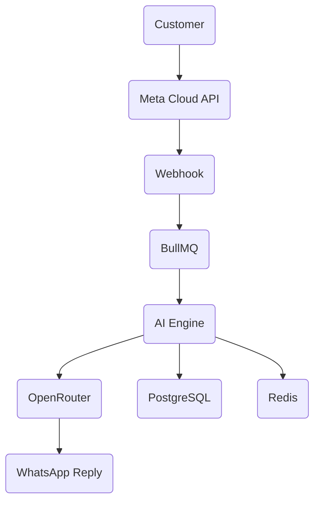

<div align="center">

# 🤖 WhatsApp AI Assistant

### Intelligent Customer Support • Multi-Business Ready • Production Ready


<br>


</div>

---

# 🚀 Overview

This project is a **production-ready AI-powered WhatsApp automation platform** built directly on the **Meta WhatsApp Cloud API**.

Unlike traditional chatbot solutions, this system focuses on creating **human-like conversations**, maintaining **conversation memory**, supporting **multiple businesses**, and providing seamless AI-powered customer interactions.

Whether it's answering product questions, handling customer inquiries, recognizing returning users, or escalating conversations to human staff, everything happens automatically.

---

# ⚡ Core Capabilities

```
📱 Customer Message
          │
          ▼
 Meta WhatsApp Cloud API
          │
          ▼
Webhook Verification
          │
          ▼
 Conversation Queue
          │
          ▼
 AI Processing
          │
          ▼
 Memory + Business Context
          │
          ▼
 Smart Response
          │
          ▼
 WhatsApp Reply
```

---

# ✨ Features

### 💬 Intelligent Conversations

* Natural language conversations
* Context-aware replies
* Memory across messages
* Personalized responses

---

### 🧠 AI Engine

* Claude
* GPT
* Gemini
* DeepSeek
* Any OpenRouter model

Switch models by changing **one environment variable**.

---

### 🏢 Multi Business Support

One application can serve multiple businesses.

Each business has:

* Separate knowledge base
* Separate prompts
* Separate customers
* Separate conversations

---

### 📷 Media Support

✔ Images

✔ Vision Models

✔ Documents

✔ Audio

✔ Video Detection

---

### 🔄 Automatic Escalation

If AI cannot answer:

```
Customer
    │
    ▼
AI Confidence Check
    │
    ▼
Needs Human?
    │
 ┌──┴─────┐
 │ Yes    │
 ▼        ▼
Notify   AI Reply
Admin
```

---

# 🏗 Architecture



---

# ⚙ Technology

| Layer      | Technology |
| ---------- | ---------- |
| Frontend   | React      |
| Backend    | Node.js    |
| Runtime    | TypeScript |
| Framework  | Fastify    |
| Database   | PostgreSQL |
| Queue      | BullMQ     |
| Cache      | Redis      |
| AI         | OpenRouter |
| Deployment | Docker     |

---

# 📁 Project Structure

```text
src/

├── modules/
│      ├── whatsapp/
│      ├── llm/
│      ├── conversation/
│      ├── customers/
│      └── workers/
│
├── queues/
├── prisma/
├── config/
├── tests/
│
└── server.ts
```

---

# 🚀 Quick Start

Clone

```bash
git clone https://github.com/tejureddy157/whatsapp-ai-agent.git
```

Install

```bash
npm install
```

Run Server

```bash
npm run dev:server
```

Run Worker

```bash
npm run dev:worker
```

---

# 🧩 AI Workflow

```text
Customer Message

      │

      ▼

Webhook Verification

      │

      ▼

Conversation Memory

      │

      ▼

Business Knowledge

      │

      ▼

LLM Processing

      │

      ▼

Safety Check

      │

      ▼

WhatsApp Response
```

---

# 📊 GitHub Dashboard

<p align="center">


</p>

---

# 📈 Contribution Graph

<p align="center">


</p>

---

# 🎯 Roadmap

* ✅ Meta Cloud API
* ✅ Conversation Memory
* ✅ AI Replies
* ✅ Multi Business Support
* ✅ Human Escalation
* ⏳ CRM Integration
* ⏳ Admin Dashboard
* ⏳ RAG Knowledge Base
* ⏳ Analytics
* ⏳ Voice Assistant

---

# 🌍 Connect

<p align="center">

<a href="https://github.com/tejureddy157">

</a>

<a href="https://linkedin.com">

</a>

</p>

---

<div align="center">

## ⚡ Built for Modern Businesses

**Automate Conversations • Delight Customers • Scale Support**

⭐ **If this project helped you, consider giving it a star!**

</div>
